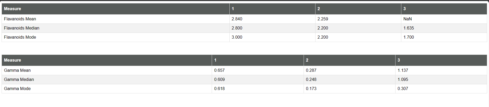

Running the project:

1. Clone the repository to your local machine.
2. Install the necessary dependencies by running: yarn install.
3. Start the development server: yarn start.
4. Open your web browser and visit http://localhost:3000 to see the React app.

Screenshot of both the tables:
